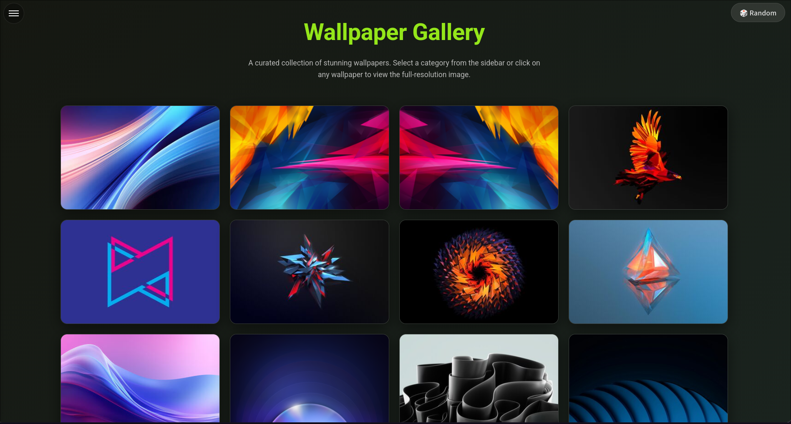
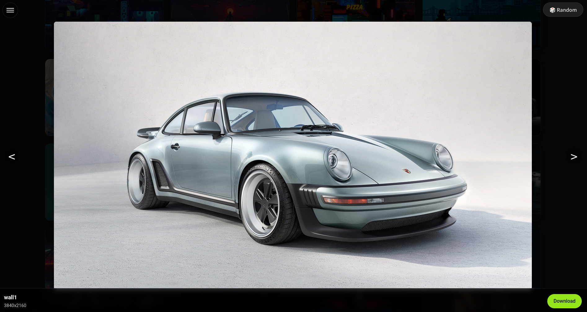
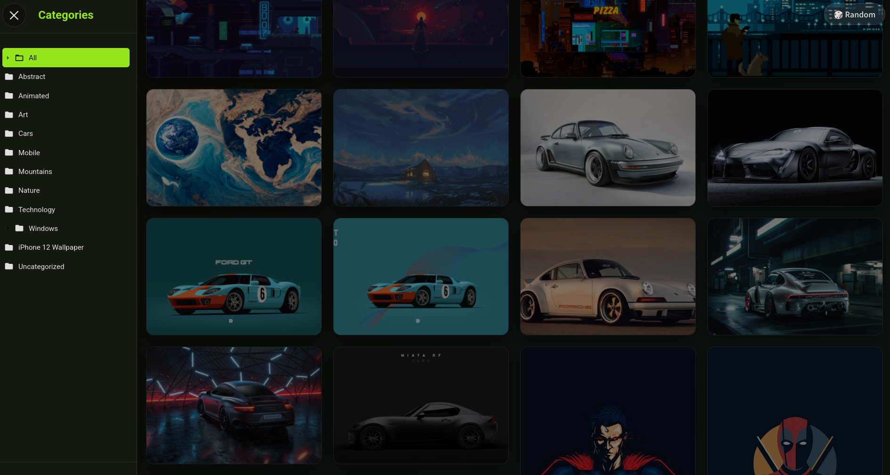

<div align="center">
  <h1>Wallpaper Gallery</h1>
  <p>A curated collection of stunning wallpapers, fully automated and ready for deployment.</p>
</div>

## 📸 Screenshots

<div align="center">
  
  
  
</div>

## ✨ Live Demo

You can view the live wallpaper gallery hosted from this repository here: **[Live Gallery](https://wallsite.vercel.app/)**

> [!NOTE]
> This repository serves as the live demo. To create your own gallery, please use the template repository linked below.

---

## 🚀 Get Your Own Wallpaper Gallery

You can create your own version of this gallery in two ways: the easy way using the GitHub template, or the advanced way by self-hosting with Docker.

### Method 1: Easy Deployment (Recommended)

This method uses a GitHub template to create a copy of the project in your own account, which you can then deploy for free on services like Vercel or Netlify.

**[➡️ Use the Template Repository](https://github.com/Rishabh5321/wallsite-template/generate)**

1.  Click the link above to generate a new repository in your GitHub account.
2.  On the new repository page, click the "Deploy" button for your preferred service:

<div align="center">
  <a href="https://vercel.com/new/clone?repository-url=https%3A%2F%2Fgithub.com%2FRishabh5321%2Fwallsite-template"></a>
  <a href="https://app.netlify.com/start/deploy?repository=https://github.com/Rishabh5321/wallsite-template"></a>
</div>

#### Adding Wallpapers (The Easy Way)

Once your repository is created and deployed:
1.  Go to your new repository on GitHub.
2.  Navigate to the `src` folder.
3.  Click **Add file** > **Upload files** and upload your wallpapers.
4.  Commit the changes directly to the `main` branch.

That's it! A GitHub Action will automatically run, generate thumbnails, update the gallery, and your hosting service (Vercel/Netlify) will deploy the changes.

---

### Method 2: Advanced Deployment (Self-hosting with Docker)

This method is for users who want to host the gallery on their own server or infrastructure using Docker. Click the logo to see the `docker-compose.yml` file.

<div align="center">
    <a href="docker-compose.yml" title="View docker-compose.yml"></a>
</div>

1.  **Pull the Docker Image:**
    The pre-built image is available on the GitHub Container Registry.
    ```bash
    docker pull ghcr.io/rishabh5321/wallsite:latest
    ```

2.  **Create a `src` Directory:**
    On your local machine or server, create a directory and fill it with your wallpapers.
    ```bash
    mkdir -p /path/to/your/wallpapers/src
    # Add your images to this directory
    ```

3.  **Run the Container:**
    Run the Docker container, making sure to mount your local `src` directory into the container at `/app/src`.
    ```bash
    docker run -d -p 8000:8000 \
      -v /path/to/your/wallpapers/src:/app/src \
      --name my-wallsite \
      ghcr.io/rishabh5321/wallsite:latest
    ```
    Your gallery will be running at `http://localhost:8000`.

#### Using `docker-compose`

For easier management, you can use the [`docker-compose.yml`](docker-compose.yml) file provided in the repository. It's already configured to use the pre-built image and mount a local `./src` directory.

1.  Save the `docker-compose.yml` file to your machine.
2.  Create a `src` directory in the same location.
3.  Run `docker-compose up -d`.

---

## 🎨 How It Works

*   **For Template Users:** The template repository contains a GitHub Actions workflow (`.github/workflows/update-gallery.yml`). When you push new images to the `src` folder, this action automatically generates thumbnails, updates the gallery data file, and commits the changes back to your repository. Your connected Vercel/Netlify site then deploys these changes.
*   **For Docker Users:** The Docker container runs an entrypoint script (`docker-entrypoint.sh`) on startup. This script runs the same gallery generation process inside the container before starting the web server.

## License

The code in this repository is licensed under the MIT License. See the [LICENSE](LICENSE) file for details. Wallpapers are not covered by this license.
